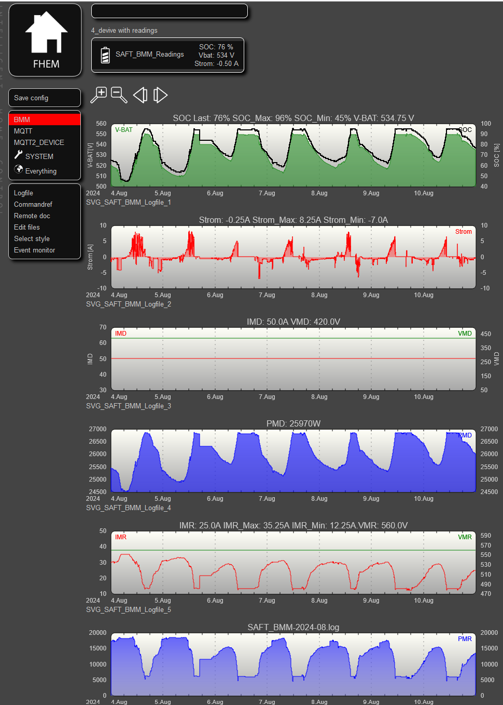
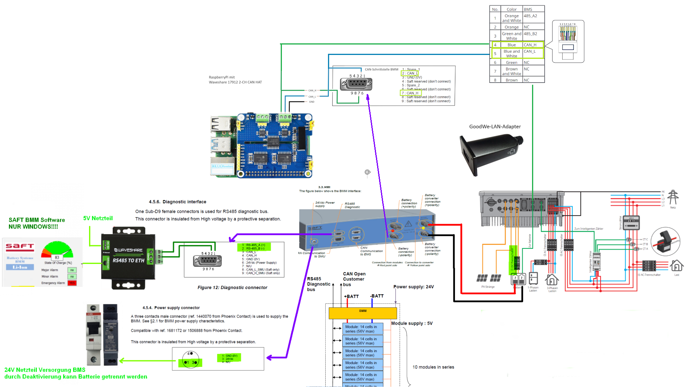
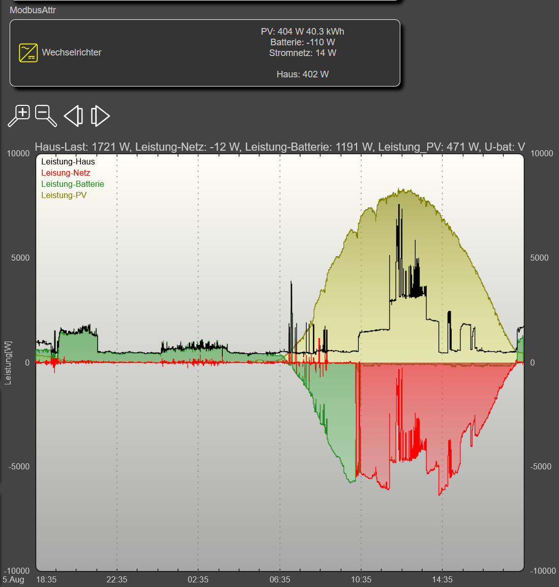

# erweitertes Python Script von Michael - SaftBMSGoodwe2.py

Mit der Erweiterung erzeugt das Script ein Logfile im Ordner /opt/fhem/Saft_BMM-yyyy-mm.log mit folgender Struktur

''2024-08-01_21:55:56 SAFT_BMM sOC: 70 internalBatteryVoltage: 526.075 internalBatteryCurrent: -1.0 batterySystemMode: 3 rawBatteryContactorsStatus: 1 IMD: 50.0 VMD: 420.0 PMD: 25680 batteryRequests: 0 IMRContinuous: 23.5 IMR: 29.0 VMR: 560.0 PMR: 15350 globalBatteryStatus: 0 sOCThreshold: 0 ''

Auf Änderungen in diesem File reagiert FHEM und aktualisiert seine internen Readings und Plots.

# Monitor Script for SaftBMSGoodwe2.py - SaftBMSGoodwe2_Monitor.pl

Das Perl Skrit SaftBMSGoodwe2_Monitor.pl übwerwacht ob das Python Skript läuft und startet ggf. neu. Dies soll die Stabilität erhöhen falls es zu Abbrüchen kommt. 

Das Script wird automtisch bei Systemstart ausgeführt hierzu folgende Anpassungen vornehmen.

Crontab aufrufen:<br>
```sudo nano /etc/crontab```

Zeile einfügen<br>
```*/5 * * * * pi /opt/fhem/SaftBMSGoodwe2_Monitor.pl```

Speichern mit Str-O
Verlassen mit Str-X

Die Funktion sowie die PID des Überwachungsskript lässt sich am File SaftBMSGoodwe2.log erkennen.

2024-08-18 14:50:01 - Das Skript SaftBMSGoodwe2.py läuft nicht. Starte neu... <br> 
2024-08-18 14:50:01 - Das Skript SaftBMSGoodwe2.py wurde gestartet mit PID 27395: <br> 
2024-08-18 14:55:02 - Das Skript SaftBMSGoodwe2.py läuft bereits mit der PID 27395. <br> 


# Kurzanleitung FHEM_BMM 

 

## Motivation

Der Batterieschrank aus der ursprünglichen Caterva-Umgebung soll in Kombination mit einem Goodwe Hybrid Wechselrichter weiter betrieben werden.
Michael hat ein Python-Script geschrieben, welches die Daten aus dem Saft Batterie Management Modul extrahiert.
Mit FHEM sollen diese Daten visualisiert werden.

## Funktionsumfang

Auf der Weboberfläche können die extahierten Daten als Plot angezeigt werden...  <br>
... Batreriespannung und Strom<br>
... Maximale Lade und Entladeströme<br> 
... Maximale Lade und Entladeleistung <br> 

Zusätzlich können die Daten an einen MQTT-Server gesendet werden und damit in vorhandene Hausautomatisierungsysteme eingebunden werden.

## Aufbau:

 

## Stückliste:

Batteriemanagement System:
- BMM: P/N 776354-00
- 24Volt Netzteil z.B. Mean Well HDR-30-24

RS485-Kommunikation
- Waveshare RS485 to ETH Adapter
- Spannungsversorgung gemeinsam mit BMM am 24 Volt Netzteil

CAN-Kommunikation:
- Raspberry-PI mit Netzteil mit Hutschinengehäuse <br>
- Waveshare 17912 2-CH CAN HAT <br>

Modbus-Anbindung (optional)
- LAN-Apapter für GoodWe Wechselrichter. GA10081-37-00P

## FHEM Files:
folgende Files können auch in einen bestehende FHEM-Installation übernommen werden wenn nicht das gesamte Repository übernommen werden soll.

- **/opt/fhem/fhem.cfg** <br>
        Hier werden alle übrigen .cfg Files über einen include eingebunden.

- **/opt/fhem/FHEM/00_SAFT_BMM.cfg** <br>
        Reagiert auf Änderungen am Logfile SAFT_BMM-yyyy-mm.log im Verzeichnis /opt/fhem/log

- **/opt/fhem/FHEM/99_myUtils.pm** <br>
        Unterfunktion zur Erzeugung der Readings aus dem Logfile

- **/opt/fhem/FHEM/00_MQTT_Interface.cfg** <br>
        Verbindet sich in dieser Konfiguration mit dem MQTT-Server (localhost)
        Gibt es bereits einen MQTT Server in dieser Zeile die IP Nummer eintragen. <br>
        ``` define mqttClient MQTT2_CLIENT 127.0.0.1:1883 ```<br>
        Weiterhin diese Zeile im fhem.cfg auskommentieren<br>
        ``` include ./FHEM/00_MQTT_Server.cfg ```<br>

- **/opt/fhem/FHEM/00_MQTT_Server.cfg** <br>
        MQTT Server falls noch kein eigener Server vorhanden.

- **/opt/fhem/FHEM/00_Goodwe.cfg** <br>
        Optionale Einbindung des Goodwe Wechselrichters in FHEM. <br>
        Genutzt wird die MODBUS Schnittstelle des Wechselrichters. **Zur Verwendung ist der GoodWe-LAN Adapter erforderlich.**<br>
        Folgende Zeile die IP-Nummer des Wechselrichters eintragen.<br>
        ```define GoodweET10 ModbusAttr 247 30 192.178.168.184:502 TCP```<br> <br>
        Durch diese Einbindung können folgende sämtliche Energiewerte, Leistungswerte der einzelnen Phasen sowie Backup-Ausgänge, Frequenzen, Ströme ausgelesen werden. Weiterhin Batterie-Spannung und Ströme.<br>
        Die Einbingung nutze ich für Überschussladen am der Wallbox sowie Ansteuerung der Wärmepumpe.<br>
        Bei Benutzung die Auskommentierung der folgende Zeile in der fhem.cfg entfernen. <br> 
        ```#include ./FHEM/00_Goodwe.cfg ```<br> <br>
         


## Daten aus Github überspielen (ungetestet)

- Zunächst auf Github einen User anlagen falls noch nicht vorhanden. <br> 
- der .git Ordner soll im Unterordner /opt/fhem/ liegen also vorab in diesen Ordner wechseln.<br> 
        ```cd /opt/fhem```<br> 
- SSH-Schlüssel generieren:<br> 
        ```ssh-keygen -t rsa -b 4096 -C "your_email@example.com"```<br> 
- SSH-Agent starten und Schlüssel hinzufügen:<br> 
        ```eval "$(ssh-agent -s)"```<br> 
        ```ssh-add ~/.ssh/id_ed25519```<br> 
- Öffentlichen Schlüssel zu GitHub hinzufügen:<br> 
        Kopiere den Inhalt deines öffentlichen Schlüssels (~/.ssh/id_ed25519.pub) und füge ihn zu deinem GitHub-Konto hinzu:<br> 
        ```cat ~/.ssh/id_ed25519.pub```<br> 
        Kopiere den gesamten Inhalt.<br> 
        Gehe zu GitHub, navigiere zu Settings > SSH and GPG keys und füge einen neuen SSH-Schlüssel hinzu.<br> 
- Verbindung zu GitHub testen:
        ```ssh -T git@github.com```
- Git installieren:<br> 
        ```git --version``` # schon installiert?<br>
        ```sudo apt update```<br> 
        ```sudo apt upgrade```<br>
        ```sudo apt install git``` <br> 
- Repository klonen:<br> 
        ```cd /opt/fhem/```<br>
        ```git clone git@github.com:meschnigm/BMM.git```<br> <br> 

## Benutzerrechte für FHEM anpassen: <br>

```sudo chmod 755 -R /opt/fhem```<br> 
```sudo chown -R fhem:dialout /opt/fhem/```<br> 


